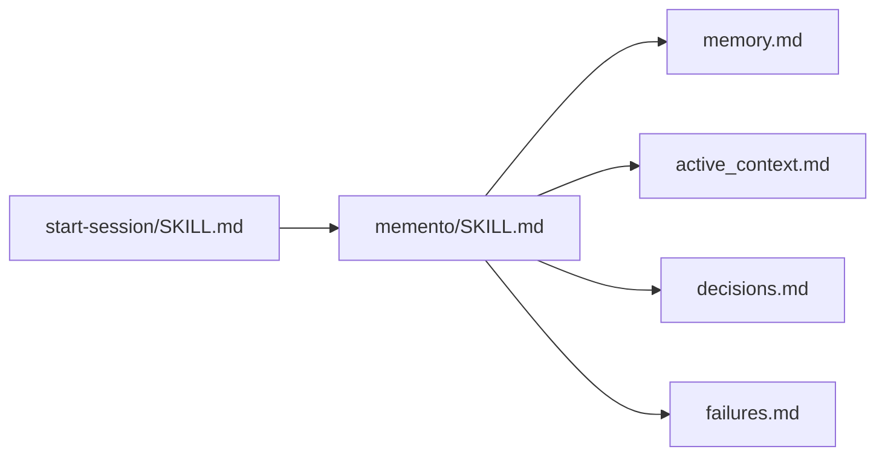
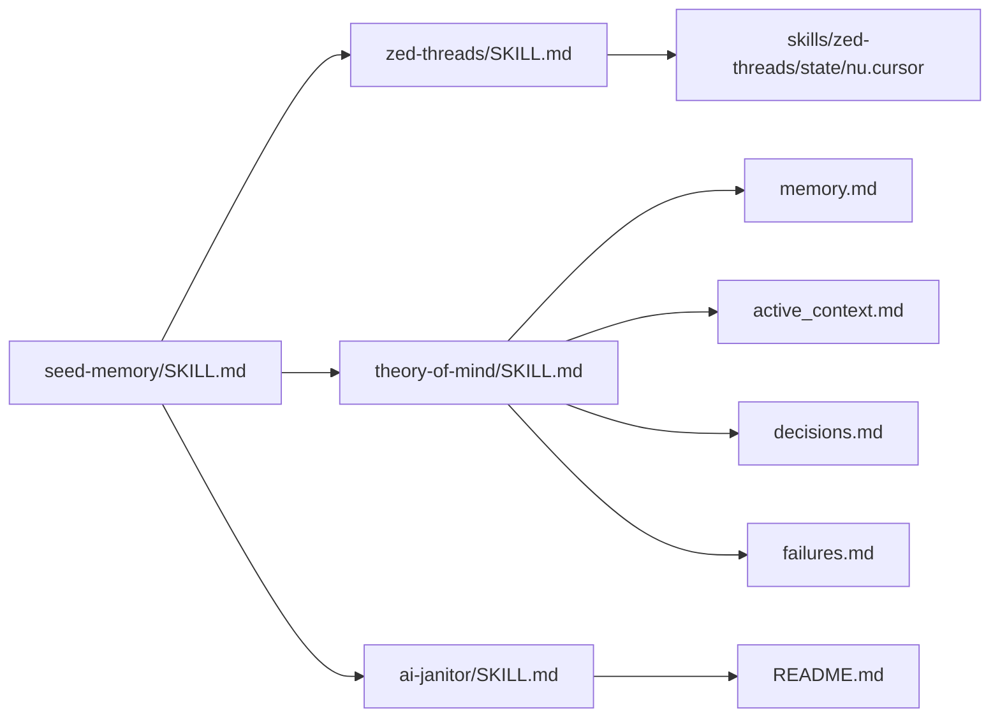
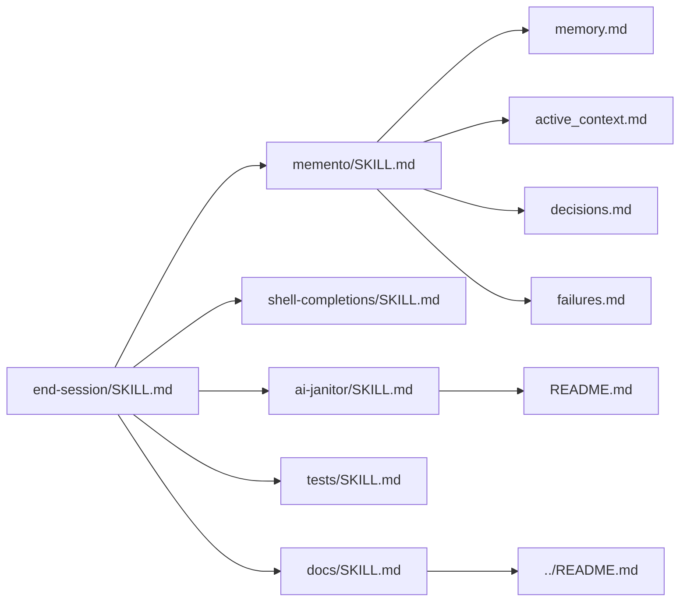

# .agents Workspace Guide

This file documents skills, memory artifacts, and state files under `.agents`.

## Skills

- `start-session/SKILL.md`: session bootstrap skill that loads persistent memory artifacts.
- `seed-memory/SKILL.md`: historical seeding skill that ingests Zed threads and reconstructs long-term memory files.
- `end-session/SKILL.md`: session close-out skill that persists new learnings into memory artifacts and refreshes workspace docs.
- `memento/SKILL.md`: maintains session-to-session memory continuity (`memory.md`, `active_context.md`, `decisions.md`, `failures.md`).
- `shell-completions/SKILL.md`: keeps shell completion/module generators and install paths aligned with CLI changes.
- `theory-of-mind/SKILL.md`: compresses historical discussions into coherent project memory.
- `zed-threads/SKILL.md`: ingests Zed `threads.db` incrementally with cursor state.
- `ai-janitor/SKILL.md`: keeps this README synchronized whenever `.agents` artifacts change.
- `tests/SKILL.md`: updates and runs existing unit tests without creating new tests.
- `docs/SKILL.md`: enforces conditional docs maintenance policy (update root README only when non-`.agents` files changed in the session).

## Other Markdown Files

- `memory.md`: durable project overview, architecture, constraints, and conventions.
- `active_context.md`: current focus, immediate issues, and next actions.
- `decisions.md`: chronological log of key technical/product decisions.
- `failures.md`: chronological log of failed approaches and lessons learned.
- `README.md`: canonical `.agents` workspace index and dependency map.

## State and Support Files

- `skills/zed-threads/state/nu.cursor`: integer cursor for incremental Zed-thread ingestion progress.

## Dependency Graph

### Start-session flow

### Seed-memory flow

### End-session flow

