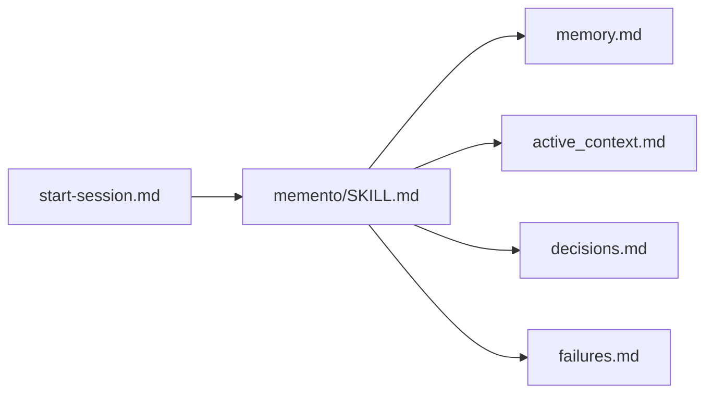
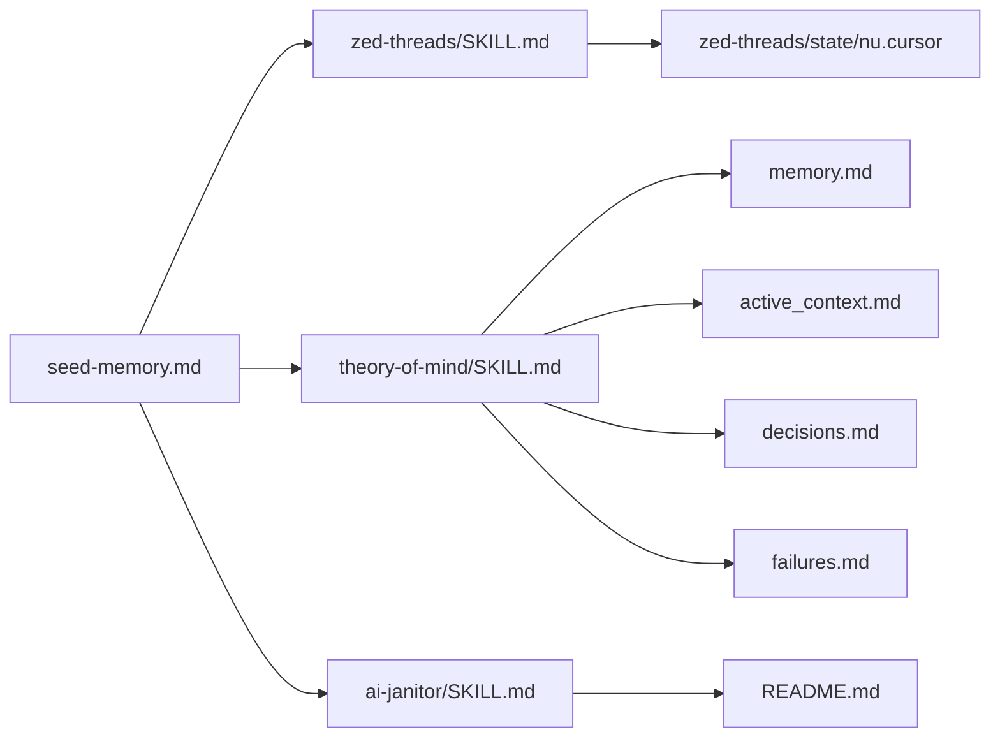

# .ai Workspace Guide

This file documents the prompts, skills, and memory artifacts under `.ai`.

## Prompts

- `start-session.md`: `@` this file at the top of every thread. It loads persistent project memory files at session start.
- `end-session.md`: `@` this file, before closing a thread. It persists current-session outcomes into long-term memory files.
- `seed-memory.md`: `@` this file if you wish to read multiple Zed threads and seeds project memory files, usually run once at the start of a project, or if you forgot to use `start-session.md` and `end-session.md`.

## Skills

- `memento/SKILL.md`: maintains ongoing project memory (`memory.md`, `active_context.md`, `decisions.md`, `failures.md`).
- `theory-of-mind/SKILL.md`: compresses historical discussions into coherent memory seed updates.
- `zed-threads/SKILL.md`: reads and decodes Zed `threads.db` incrementally, one thread at a time, requires `nushell`.
- `ai-janitor/SKILL.md`: keeps this `README.md` synchronized whenever `.ai` changes.

## Other Markdown Files

- `memory.md`: high-level durable project knowledge and architecture context.
- `active_context.md`: current task focus, open issues, and next actions.
- `decisions.md`: chronological log of important technical decisions.
- `failures.md`: chronological record of failed approaches and lessons learned.
- `README.md`: index of `.ai` prompts, skills, and dependency flow.

## State and Support Files

- `zed-threads/state/nu.cursor`: persistent cursor for incremental thread ingestion progress.

## Dependency Graph

### Start-session flow



### Seed-memory flow



### End-session flow

```mermaid
graph LR
  end["end-session.md"] --> memento["memento/SKILL.md"]
  end --> janitor["ai-janitor/SKILL.md"]

  memento --> memory["memory.md"]
  memento --> active["active_context.md"]
  memento --> decisions["decisions.md"]
  memento --> failures["failures.md"]

  janitor --> readme["README.md"]
```
